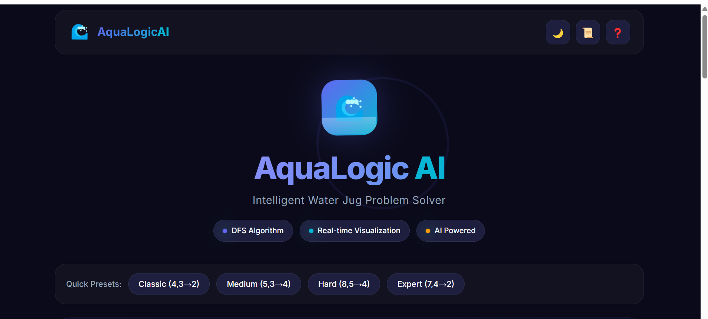
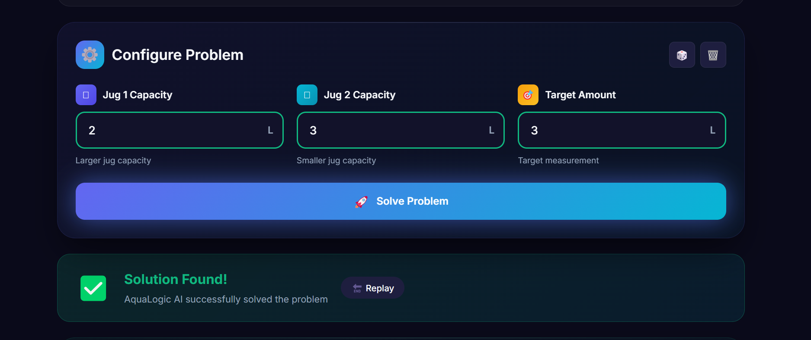
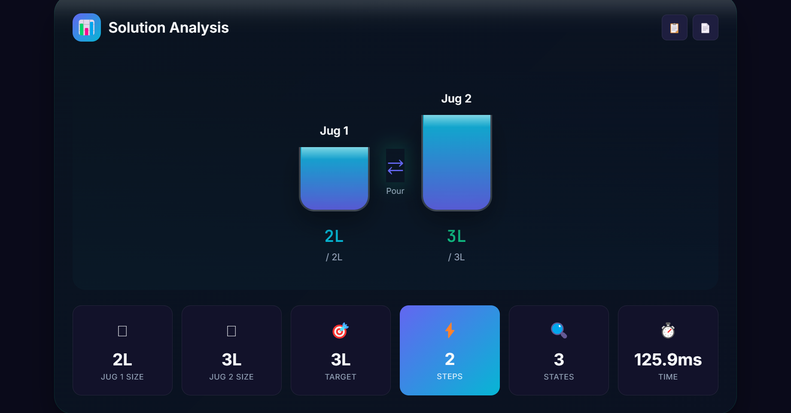
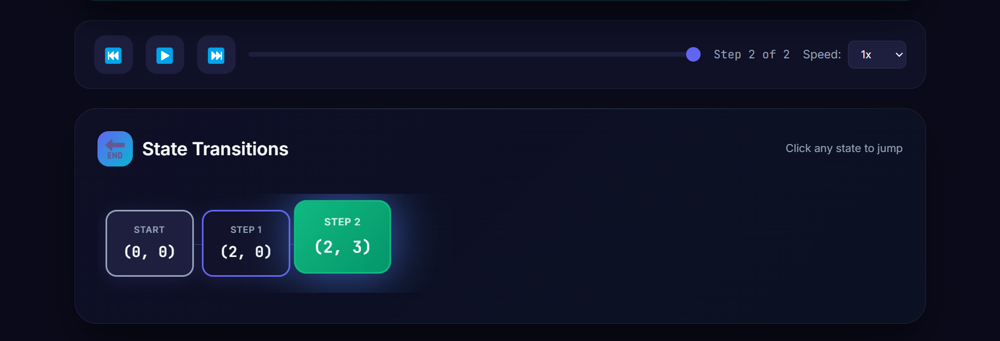
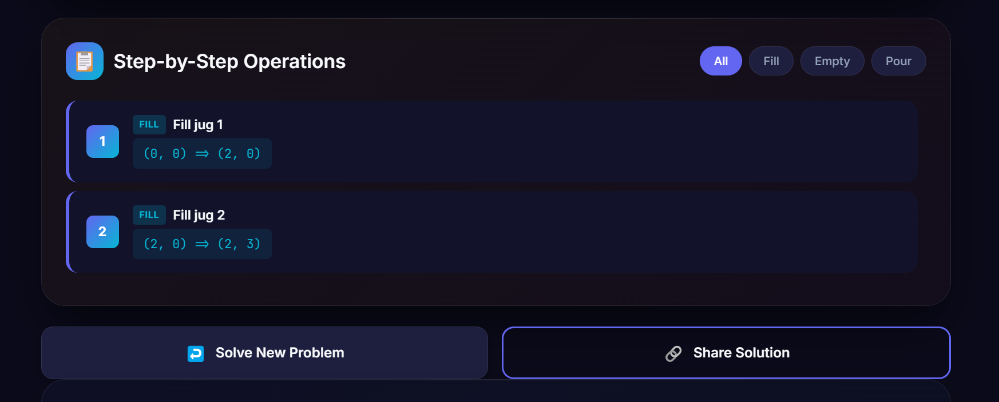

# AquaLogic AI - Smart Water Jug Solver

A professional web application that solves the Water Jug Problem using the Depth-First Search (DFS) algorithm.

## Screenshots

### Main Interface


### Input Configuration


### Solution Visualization


### Step-by-Step Operations


### Water Jug Animation


## Features

✨ **Professional UI/UX**
- Modern, responsive design with gradient backgrounds
- Glass-morphism effects and smooth animations
- Beautiful card-based layout with dark/light theme
- Mobile-friendly interface

🎯 **Core Functionality**
- Solves the Water Jug Problem using DFS algorithm
- Real-time solution visualization with animated water jugs
- Step-by-step operation display with playback controls
- State transition timeline
- Quick presets for common puzzles
- History tracking and export functionality

## Project Structure

```
flask_app/
├── app.py                 # Flask application and WaterJug solver logic
├── requirements.txt       # Python dependencies
├── templates/
│   └── index.html        # Main HTML template
└── static/
    ├── css/
    │   └── style.css     # Professional styling
    └── js/
        └── script.js     # Client-side interactivity
```

## Installation & Setup

### Prerequisites

- Python 3.7 or higher
- pip (Python package manager)

### Steps

1. **Navigate to the flask_app directory:**

   ```bash
   cd flask_app
   ```

2. **Install dependencies:**

   ```bash
   pip install -r requirements.txt
   ```

3. **Run the Flask application:**

   ```bash
   python app.py
   ```

4. **Open your browser:**
   Navigate to `http://localhost:5000`

## Usage

1. **Enter Jug Capacities:**
   - Input the capacity of Jug 1 (in liters)
   - Input the capacity of Jug 2 (in liters)
   - Enter the target amount to measure (in liters)

2. **Click "Solve":**
   The application will compute the solution using DFS

3. **View Results:**
   - Solution summary with jug capacities and target
   - Visual state transitions showing water states
   - Detailed step-by-step operations
   - Total number of moves required

## Default Example

**Problem:** Given two jugs with capacities of 4 liters and 3 liters, find a sequence of operations to measure exactly 2 liters in one of the jugs.

**Solution:** 5 moves

## How the Algorithm Works

The application uses **Depth-First Search (DFS)** to explore all possible states:

### Available Operations

1. **Fill** - Fill a jug to its maximum capacity
2. **Empty** - Empty a jug completely
3. **Pour** - Transfer water from one jug to another until:
   - The source jug is empty, OR
   - The destination jug is full

### State Representation

States are represented as (x, y) where:
- x = amount of water in Jug 1
- y = amount of water in Jug 2

## Technical Details

- **Backend:** Flask (Python)
- **Frontend:** HTML5, CSS3, Vanilla JavaScript
- **Algorithm:** Depth-First Search (DFS)
- **Features:** Real-time validation, error handling, responsive design

## Browser Compatibility

- Chrome/Chromium ✓
- Firefox ✓
- Safari ✓
- Edge ✓

## Performance

- Efficient DFS implementation with memoization
- Client-side form validation for instant feedback
- Smooth animations and transitions for better UX

## Version History

- **v2.0** - Enhanced UI with AquaLogic AI branding, playback controls, history, and themes
- **v1.0** - Initial release with professional UI and full DFS functionality

## Author

**Shumaila Maryam**

## License

Free to use for educational purposes.
